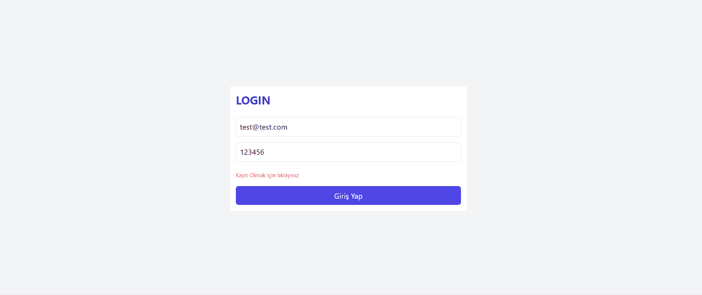

<h2>MERN (React, Express, NodeJS, MongoDB, Redux, Tailwind, JWT) Stack Proje Yapıldı</h2>

<h3>Kütüphaneler, web token, veri tabanı, backend ve frontend çalışmları yapıldı; login, logout, register ve update işlemleri öğrenildi</h3>

<h4>Gif Dosyası Eklendi</h4>

